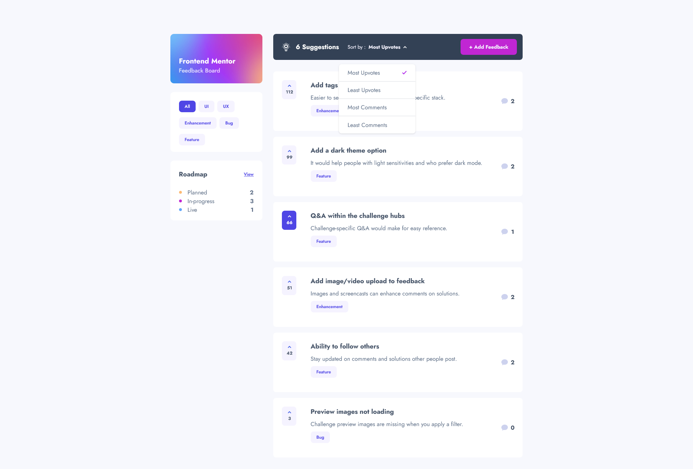

# Frontend Mentor - Product feedback app solution

This is a solution to the [Product feedback app challenge on Frontend Mentor](https://www.frontendmentor.io/challenges/product-feedback-app-wbvUYqjR6). Frontend Mentor challenges help you improve your coding skills by building realistic projects.

## Table of contents

- [Overview](#overview)
  - [The challenge](#the-challenge)
  - [Built with](#built-with)
  - [Links](#links)
  - [Screenshot](#screenshot)

## Overview

### The challenge

Users should be able to:

- View the optimal layout for the app depending on their device's screen size ✅
- See hover states for all interactive elements on the page ✅
- Create, read, update, and delete product feedback requests ✅
- Receive form validations when trying to create/edit feedback requests ✅
- Sort suggestions by most/least upvotes and most/least comments ✅
- Filter suggestions by category ✅
- Add comments and replies to a product feedback request ✅
- Upvote product feedback requests ✅
- **Bonus**: Keep track of any changes, even after refreshing the browser (`localStorage`) could be used for this if you're not building out a full-stack app) ✅

### Built with

- [Next.js 13](https://nextjs.org/)
- [React](https://reactjs.org/)
- [TypeScript](https://www.typescriptlang.org/)
- [TailwindCSS](https://tailwindcss.com/)
- [HeadlessUI](https://headlessui.com/)
- [React Hook Form](https://react-hook-form.com/)
- [Zustand](https://github.com/pmndrs/zustand)

### Links

- Solution URL: [https://www.frontendmentor.io/solutions/product-feedback-app-nextjs-typescript-tailwindcss-SXBC5xAKIl](https://www.frontendmentor.io/solutions/product-feedback-app-nextjs-typescript-tailwindcss-SXBC5xAKIl)
- Live Site URL: [https://product-feedback-app-pink.vercel.app/](https://product-feedback-app-pink.vercel.app/)

### Screenshot

